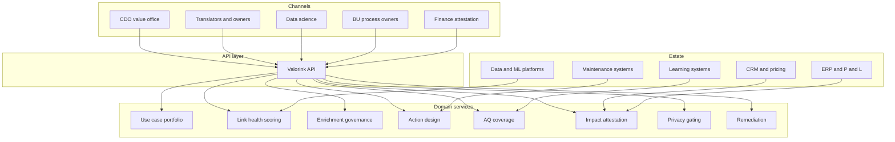

# Valorink

**Source:** `ai-in-enterprise/Achieving-business-impact-with-data_FINAL/`
**Domain:** `ai-enterprise`
**One-liner:** A multiplicative insights-value-chain health and P&L attribution system that finds the weakest link between data, analytics, IT, people, and processes — then proves whether use cases actually moved top-line or bottom-line numbers.
**Wedge:** Central Analytics CoEs in banking, telecom, and industrial firms that have models in production but cannot show board-grade impact because adoption, process redesign, or data relevance — not algorithms — is the zero in the chain.
**Positioning:** An impact-operating system for the insights value chain. The source’s decisive claim is that the chain is **multiplicative**: if any link is zero, impact is zero. Valorink operationalises that claim with link health scores, man+machine enrichment governance, and reference-case impact tracking (e.g., churn, pricing, predictive maintenance) rather than celebrating another dashboard.

## Market research synthesis

### Thesis from source

McKinsey authors Mohr and Hürtgen argue that data volume (driven by IoT), algorithmic methods (including machine learning), and cheaper compute/storage have converged — sensors delivered globally rose from roughly **4 bn toward >30 bn** (about **×7**), while IoT node costs were expected to fall sharply (MCU, connectivity, sensor components with **~-15% CAGR** price deflation toward 2020). Data is framed as a new corporate asset class, unlocked by digitising customer interactions and internal processes. Yet the paper’s lasting insight is organisational: people over-focus on single technical components of the **insights value chain** (data, analytics, IT upstream; people and processes downstream), under an umbrella of strategy/vision and operating-model governance.

The chain is **multiplicative** — “you are only as good as the weakest link.” Upstream covers generating/collecting relevant data (use-case-backwards relevance over brute-force lakes; data layering; privacy/GDPR) and refinement (enrichment via domain knowledge / feature engineering, then ML extraction across descriptive → predictive → prescriptive). Downstream covers turning insights into action (prediction ≠ prevention), driving adoption via workforce **analytics quotient (AQ)** and translator skills, and mastering tech/org governance (often start CoE-centralised, then federate into BUs). Practice guidance groups value into **top-line** (pricing, churn, cross-sell, promotion), **bottom-line** (predictive maintenance, supply chain, fraud), and **new business models**. Reference impacts from **100+ cases over 1–3 years** include illustrative ranges such as marketing spend effectiveness **5–10%**, warehousing via demand planning **20–30%**, predictive maintenance affecting **20–50% of call-center costs**, fraud loss **1–5%**, logistics **10–30%**, churn/pricing/cross-sell on the order of **~1–2% sales** or **~0.5–1.0 ppt margin** — with the explicit caveat that impacts are **not additive** and require investment **and change management**.

### Buyer & economic model

- **Primary buyer:** Chief Data Officer / Head of Advanced Analytics accountable for board-reported data value realisation.
- **Users:** analytics translators and use-case owners (daily), data engineers/scientists (enrichment and model evidence), BU process owners (action redesign), CoE operating-model leads, finance value office.
- **Budget owner / value metric:** analytics and digital investment portfolio; value metric is **verified P&L movement per use case** and **weakest-link remediation cycle time**, not model accuracy alone.
- **Competing status quo:** use-case slides with aspirational Exhibit-6 percentages, separate data-quality tools, separate MLOps, and finance “benefits trackers” disconnected from whether processes and AQ actually changed.

### Domain constraints

- **Regulatory / trust / safety:** privacy/legal (e.g., GDPR) and data security are named chain components; impact claims for customer decisions must remain auditable.
- **Data sensitivity:** enrichment variables and customer features are commercially and personally sensitive; impact ledgers must expose aggregates to boards without leaking model features broadly.
- **Change-management realities:** algorithms are commoditising while proprietary data and frontline AQ are not; CoE-to-BU federations fail when translators are missing; “think business backwards, not data forward” must be enforced at intake.

## Business requirements

- BR-1: Every funded use case must declare which insights-value-chain links it depends on and receive a living health score per link (Data, Analytics, IT, People, Processes, plus Strategy and Operating Model).
- BR-2: Portfolio impact must be treated as multiplicative for go/no-go: a zero or critical-red link blocks scale claims even if model AUC is strong.
- BR-3: Use-case intake must be business-backwards — target KPI and action design before data-lake expansion is funded.
- BR-4: Enrichment steps that inject domain hypotheses (“smart variables”) must be versioned with named domain owners (man + machine), not only data-scientist commits.
- BR-5: Downstream action designs (process redesign, incentive changes, automation) must be first-class objects linked to predictive outputs — prediction without prevention cannot be marked “impact delivered.”
- BR-6: AQ / translator coverage for affected frontline roles must meet a threshold before enterprise rollout.
- BR-7: Impact tracking must use non-additive, case-specific reference bands (top-line vs bottom-line) and require finance attestation for board reporting.
- BR-8: Privacy and security controls must be scored as chain links with blocking severity for customer-data use cases.
- BR-9: Operating-model transitions (central CoE → hybrid BU embedding) must be planned with role movement and training obligations.
- BR-10: Exception path: if a use case reports “impact” while People or Processes links remain red, the claim is rejected and routed to remediation.
- BR-11: Data relevance policy must prefer use-case-defined freshness and granularity over indiscriminate storage of all IoT/event exhaust.
- BR-12: Commercial constraint: vendors and platforms are evaluated on how they raise the weakest link, not on feature checklists.

## User stories

Canonical user stories live in sibling [USER_STORIES.md](USER_STORIES.md).

## System design

### Overview

Valorink registers analytics use cases against the insights value chain, continuously scores link health, governs enrichment and action design, tracks AQ coverage, and attests financial impact. Upstream technical evidence (data quality, model performance, platform capacity) and downstream business evidence (process change, adoption, P&L) meet in a single portfolio object so the organisation manages the *product* of the links rather than isolated excellence.

### Actors & boundaries

- **Actors:** CDO/value office, translators/use-case owners, data scientists, BU process owners, finance attestants, privacy/admin.
- **Trust boundary:** feature-level data stays in analytic platforms; Valorink stores scores, ownership, action designs, and attested aggregates. Finance systems remain authoritative for P&L.
- **Human-in-the-loop points:** scale gates on red links; finance attestation; privacy blocks; impact-claim rejection.

### Core capabilities

1. **Use-case portfolio** — business-backwards intake and lifecycle.
2. **Link health scoring** — multiplicative chain diagnostics.
3. **Enrichment governance** — man + machine smart-variable versions.
4. **Action design** — process, incentive, and automation bindings.
5. **AQ and translator coverage** — workforce readiness for adoption.
6. **Impact attestation** — non-additive P&L evidence with finance sign-off.
7. **Privacy and security gating** — blocking link health for regulated data.
8. **Operating-model transition** — CoE ↔ BU role plans.
9. **Remediation and exceptions** — rejected impact claims and reopen rules.

### Conceptual data

- **Primary entities:** UseCase, ChainLink, LinkHealthScore, EnrichmentHypothesis, SmartVariable, ModelEvidence, ActionDesign, TranslatorCoverage, ImpactClaim, FinanceAttestation, PrivacyControl, OperatingModelPlan, RemediationCase, AuditEvent.
- **Critical events:** use case admitted, link scored, enrichment versioned, action bound, AQ threshold met/failed, impact claimed, impact rejected, finance attested, privacy blocked, case reopened.
- **Retention / audit needs:** impact claims and attestations retained for board and audit lookback; enrichment hypotheses retained with provenance for explainability.

### Integrations (conceptual)

- **Systems of record:** finance/ERP for P&L, CRM for churn/cross-sell actions, maintenance/EAM for predictive maintenance, data catalog and ML platforms for upstream evidence, LMS for AQ training.
- **Upstream signals:** data-quality scores, model metrics, platform cost/capacity, process-mining cycle times.
- **Downstream actions:** funding gates, training assignments, process-change tickets, board impact packs.

### High-level architecture

### Success metrics

- **Leading:** median weakest-link score trend; % use cases with bound action designs; AQ coverage vs threshold; time from red link to remediation; privacy-gate pass rate.
- **Lagging:** finance-attested impact within reference bands (without illegal additive stacking); % of portfolio value with no critical-red links; reduction in “model live / process unchanged” cases; CoE-to-BU transition milestones hit.

## OpenAPI skeleton

Canonical HTTP surface lives in sibling [openapi.yaml](openapi.yaml). Summary:

- **Base path:** `/v1/...`
- **Auth:** `X-API-Key` for platform/finance integrations; Bearer JWT for operators.
- **Resource groups:** UseCases, ChainHealth, Enrichment, Actions, Impact, Privacy, Governance.
