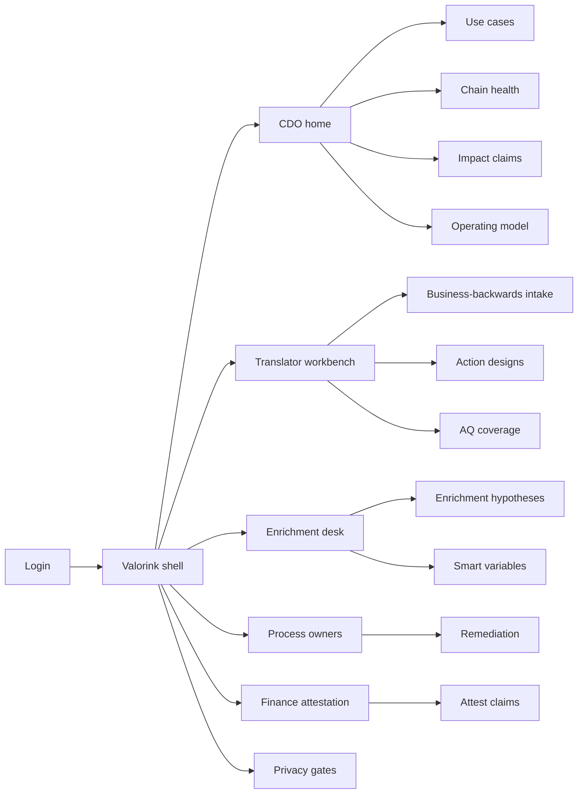
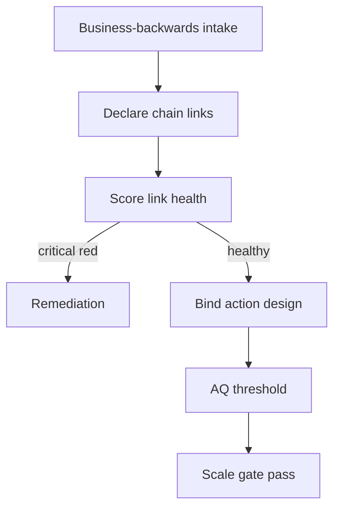

# Valorink — Web app

**Product:** [PRODUCT.md](./PRODUCT.md)
**Primary surface:** CDO / Analytics value-office console (insights value-chain health + impact attestation)
**Secondary surfaces:** Translator workbench (business-backwards intake + action binding); finance attestation desk (read/approve P&L claims)
**Design thesis:** Valorink treats impact as a product of links, not a sum of models — the UI metaphor is a multiplicative chain (Data × Analytics × IT × People × Processes under Strategy/Operating Model) where any zero collapses the claim. Visual language is deep charcoal with forge-orange for critical-red links and mint for finance-attested impact; unbroken chain glyphs replace vanity AUC tiles. The brand wordmark anchors every scale-gate and impact claim so boards know they are reading weakest-link truth, not stacked Exhibit-6 percentages.

## UX research synthesis

### Category peers (best-in-class)

- **Domo / Tableau Pulse value workspaces:** KPI-linked analytics portfolios for executives. Steal: use-case → P&L object adjacency; reject dashboard-view counts as “impact delivered.”
- **Dataiku Govern / Model Registry:** Model evidence with governance gates. Steal: upstream evidence panes; reject accuracy-alone go-live when People/Processes are red.
- **Apptio / FinOps + benefits trackers (Planview):** Finance attestation patterns for digital spend. Steal: non-editable attested impact rows; reject additive stacking of reference-band percentages.
- **Celonis Action Flows / Process Adherence:** Binding insight to process change. Steal: action design as first-class object beside prediction; reject “score in CRM, process unchanged” success states.

### Patterns to adopt / reject

- **Adopt:** Weakest-link spotlight as home; multiplicative scale gate; business-backwards intake; versioned smart variables with domain owners; AQ coverage thresholds; finance attestation required for board packs; privacy as a blocking link.
- **Reject:** Additive “total ROI” summing reference cases; purple ML marketing panels; editable attested claims; model bake-off leaderboards as default home; IoT lake expansion without use-case relevance rules.

### Trust, density, and workflow constraints from PRODUCT.md

Feature-level enrichment stays out of board views (aggregates only). Privacy/GDPR link can block customer use-case scale (BR-8). Impact claimed while People/Processes red is rejected (BR-10). CoE→BU federation needs AQ/translator thresholds (BR-6). Density is value-office grade on CDO home; translators get guided intake; finance gets a narrow attestation surface.

## Information architecture

### Nav model

### Roles → default home

| Role | Default home | Why |
|------|--------------|-----|
| CDO / value office | CDO home — weakest links + attested impact | Multiplicative reality (BR-2) |
| Use-case owner / translator | Translator workbench | Business-backwards intake (BR-3) |
| Data scientist / enrichment lead | Enrichment desk | Man+machine versions (BR-4) |
| BU process owner | Action designs + remediation | Prediction ≠ prevention (BR-5) |
| Finance attestant | Impact attestation queue | Board-grade P&L (BR-7) |
| Privacy officer | Privacy controls | Blocking link (BR-8) |

### Cross-links to OpenAPI resources

| Nav area | OpenAPI tags / resources |
|----------|---------------------------|
| Use-case portfolio, scale gate | UseCases |
| Link health scores | ChainHealth |
| Hypotheses, smart variables | Enrichment |
| Action designs | Actions |
| Impact claims, attest | Impact |
| Privacy controls | Privacy |
| Translator coverage, remediation | Governance |

## Screen inventory

### CDO home

- **Purpose:** Answer “where is the zero in our insights chain, and what P&L is actually attested?” in one composition.
- **Entry:** CDO post-login.
- **Layout regions:** Brand + portfolio filter; strip (median weakest-link score, % use cases with no critical-red, attested impact YTD, open remediations); chain glyph per top use case; alerts (false impact claims, privacy blocks).
- **Primary actions:** Open weakest use case; reject impact claim; export board pack.
- **Empty / loading / error:** Empty = admit first business-backwards use case; loading = skeleton chain glyphs; error = retry with request id.
- **BR / story ties:** BR-1, BR-2, BR-7; CDO stories.

### Use-case portfolio

- **Purpose:** Lifecycle of funded use cases with declared chain dependencies.
- **Entry:** Nav → Use cases.
- **Layout regions:** Table (KPI, top/bottom-line band, weakest link, scale status); filters by BU/reference pattern (churn, pricing, PdM).
- **Primary actions:** Open; request scale; reopen on regression.
- **Empty / loading / error:** Empty = templates for churn/pricing/maintenance; scale blocked tooltip names red link.
- **BR / story ties:** BR-1, BR-2.

### Business-backwards intake

- **Purpose:** Force target KPI and action design before data-lake funding.
- **Entry:** Translator → Intake; Create use case.
- **Layout regions:** Wizard (business outcome → action → required data relevance → analytics approach → IT); funding gate summary.
- **Primary actions:** Submit for funding; save draft; attach process owner.
- **Empty / loading / error:** Attempt to start with “need more lake storage” = blocked with thesis reminder.
- **BR / story ties:** BR-3, BR-11.

### Chain health diagnostic

- **Purpose:** Living scores for Data, Analytics, IT, People, Processes (+ Strategy, Operating Model) with multiplicative product view.
- **Entry:** Use case → Chain health; CDO drill.
- **Layout regions:** Chain rail with scores; weakest-link callout; evidence per link; scale-gate status; remediation CTA.
- **Primary actions:** Rescore; open remediation; run scale-gate check.
- **Empty / loading / error:** Missing link declaration = cannot score; critical red = coral product = 0 banner.
- **BR / story ties:** BR-1, BR-2, BR-8.

### Enrichment hypotheses and smart variables

- **Purpose:** Version domain hypotheses with named domain owners (man + machine).
- **Entry:** Science desk.
- **Layout regions:** Hypothesis list; smart-variable versions; domain owner; link to model evidence; provenance.
- **Primary actions:** Register hypothesis; publish variable version; request domain sign-off.
- **Empty / loading / error:** DS-only commit without domain owner = amber warning.
- **BR / story ties:** BR-4; data scientist stories.

### Action design binder

- **Purpose:** Bind predictions to process, incentive, or automation redesign — prevention objects.
- **Entry:** Translator/Process → Actions.
- **Layout regions:** Prediction output → action playbook mapping; incentive change tasks; automation hooks; “impact delivered” eligibility.
- **Primary actions:** Bind action; assign process owner; mark playbook live.
- **Empty / loading / error:** Prediction without action = cannot claim impact.
- **BR / story ties:** BR-5, BR-10.

### AQ / translator coverage

- **Purpose:** Workforce analytics quotient and translator coverage vs rollout threshold.
- **Entry:** Translator → AQ; scale-gate dependency.
- **Layout regions:** Role coverage map; LMS completion; threshold meter; gap list.
- **Primary actions:** Assign training; waive with audit (limited); block scale.
- **Empty / loading / error:** Below threshold = scale lock.
- **BR / story ties:** BR-6, BR-9.

### Impact claims and finance attestation

- **Purpose:** Non-additive, case-specific impact with finance sign-off for boards.
- **Entry:** CDO → Impact; Finance home.
- **Layout regions:** Claim queue (reference band, not stackable total); evidence pack; attest/reject; ledger of attested rows (immutable).
- **Primary actions:** Submit claim; attest; reject to remediation; export board slice.
- **Empty / loading / error:** People/Processes red = auto-reject path (BR-10); additive sum UI forbidden.
- **BR / story ties:** BR-7, BR-10; finance stories.

### Privacy and security link desk

- **Purpose:** Score privacy/security as chain links with blocking severity for customer data.
- **Entry:** Privacy role; use-case sidebar.
- **Layout regions:** Control checklist; lawful-basis evidence; block/scale status; audit trail.
- **Primary actions:** Update control; block scale; clear gate.
- **Empty / loading / error:** Incomplete GDPR map = coral block.
- **BR / story ties:** BR-8.

### Operating-model transition

- **Purpose:** Plan CoE-central → hybrid BU embedding with role movement and training obligations.
- **Entry:** CDO → Operating model.
- **Layout regions:** Transition timeline; role moves; AQ obligations; federation risk flags.
- **Primary actions:** Publish plan; track milestones; link to use-case AQ.
- **Empty / loading / error:** Federation without translators = amber risk.
- **BR / story ties:** BR-9.

### Remediation cases

- **Purpose:** Route rejected impact claims and red-link scale blocks to owned fixes.
- **Entry:** Alerts; process owner home; Governance.
- **Layout regions:** Queue; link under repair; owners; reopen rules when health regresses.
- **Primary actions:** Accept remediation; complete; reopen use case.
- **Empty / loading / error:** Empty = no false-impact debt.
- **BR / story ties:** BR-10; admin reopen story.

### Vendor weakest-link evaluation (light)

- **Purpose:** Score platforms on how they raise the weakest link, not feature checklists.
- **Entry:** Governance / sourcing adjunct.
- **Layout regions:** Vendor vs link uplift hypotheses; reject feature-matrix default.
- **Primary actions:** Record evaluation; attach to use case.
- **Empty / loading / error:** Checklist-only submission = reject pattern.
- **BR / story ties:** BR-12.

## Key flows

1. **Business-backwards to scale** — intake KPI/action → declare links → score health → AQ/privacy gates → scale; failure: any critical-red zeros the product.

2. **Impact attestation** — claim within reference band → check People/Processes → finance attest → immutable ledger; failure: red downstream → reject.

3. **Enrichment versioning** — domain hypothesis → smart variable → domain owner sign-off → model evidence link.

4. **False impact reopen** — attested case → People/Processes regress → auto-reopen → remediation → re-attest.

5. **Privacy block** — customer use case → privacy link red → scale blocked until lawful basis evidence.

## Design system

### Tokens (CSS variables)

- `--color-ink: #EDE6DC` — text on dark ground
- `--color-charcoal-950: #12100E` — app ground
- `--color-charcoal-900: #1C1916` — panels
- `--color-charcoal-700: #3D3832` — rules
- `--color-forge: #E07A3D` — critical-red / weakest link
- `--color-mint: #5CAF8D` — finance-attested impact
- `--color-mint-dim: #2F6B52`
- `--color-amber: #C9A227` — warning / incomplete AQ
- `--color-steel: #A3988C` — secondary labels
- `--color-brand: #D4B896` — Valorink wordmark (warm metal, not terracotta cream kit)
- `--font-display: "Libre Franklin", sans-serif`
- `--font-mono: "IBM Plex Mono", monospace` — claim ids, variable versions
- `--space-1`…`--space-8`: 4px scale
- `--radius-sm: 4px`; `--radius-md: 8px`
- `--motion-break: 220ms ease-in` — chain break when link zeros
- `--motion-attest: 180ms ease-out` — mint attest flash
- Atmosphere: faint chain-link watermark in charcoal-900; forge glow only on critical callouts; no purple AI haze.

### Typography & brand

- Display for weakest-link labels and attested $; mono for claim and variable version ids.
- Brand on scale-gate and attestation screens; login: “Impact is a product, not a sum”; one CTA.

### Do / don’t

- **Do:** Show multiplicative product; require action binding; immutable attestations; privacy as blocking link; business-backwards intake.
- **Don’t:** Stack reference % into one ROI; AUC as home; purple glow; editable attested rows; card grids of static “value themes.”

### Accessibility & domain trust cues

- AA+ contrast; red links use broken-chain icon + text.
- Live regions for scale blocks and claim rejections.
- Focus: intake → health → action → claim → attest.
- Board export excludes raw features; aggregates only.

## Component patterns

- **MultiplicativeChainRail** — link scores with product = 0 callout.
- **WeakestLinkSpotlight** — home hero diagnostic.
- **BusinessBackwardsWizard** — KPI → action → data relevance.
- **SmartVariableVersion** — domain owner + provenance.
- **ActionBinder** — prediction → prevention playbook.
- **ImpactAttestationRow** — immutable mint-locked claim.
- **AqThresholdMeter** — coverage vs scale gate.
- **PrivacyBlockBanner** — coral/forge scale lock.

## Out of scope for v1 web

- Full MLOps training IDE; data lake catalog replacement; native mobile for CDO; customer-facing churn apps; consultancy multi-tenant white-label; automatic ERP journal posting without finance human attest.
